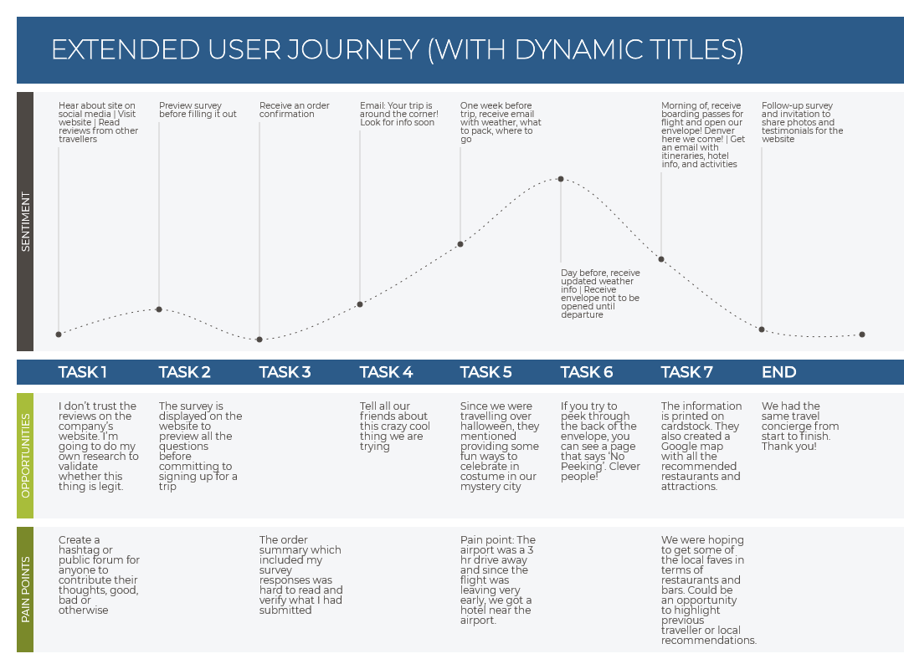

# Open source user journey map creator

Web app to dynamically create SVG and PNG images of user journey from a CSV file.
With this app, the user journey can be described in text from a CSV file and then rendered as an image to show the different journey stages.

## Usage

1. Prepare a CSV file (or export a CSV from a spreadsheet) with a separate column for each step of the journey as detailed in the data section below.
2. Select and load your CSV file.
3. Download the PNG, or use the SVG in Sketch, XD, etc to customise the appearance to suit your own style.

## Data

The CSV should be arranged in the following way (see [sample CSV](assets/data/test.csv) for details):
The first row is used for the section titles, ie these appear on the left hand side of the final image. The order of the columns is important and the columns are displayed in this order:

* column 1 - only the title in row 2 is displayed
* column 2 - the stage subtitles
* column 3 - the 'emotion' rating on a scale of 10 to 100
* column 4 - the text notes to accompany the emotion / touch points on the chart
* column 5 - the notes section for each stage
* column 6 - a section for any opportunites at a given stage

The section titles cana be renamed as required, eg to display a timescale instead of pain points.

## Example screenshot

## Bug report

Please send the report to Issues on Github.

## License

The MIT License (MIT). See LICENSE.
